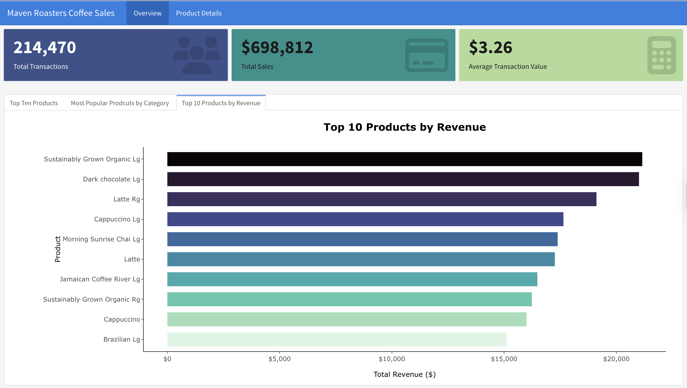

# Maven Roasters Coffee Sales Dashboard <br />

An interactive R dashboard analyzing coffee shop sales performance and customer behavior. The dataset is from Kaggle. 


## <a name="technologies"></a> Technologies
* R
* RStudio
* Flexdashboard
* Tidyverse
* Plotly
* KableExtra
* Viridis
* Readxl


## Project Overview
I developed a business intelligence dashboard analyzing ~5,000 coffee shop transactions using **R** and **flexdashboard**. The project demonstrates skills in **data validation, interactive visualization, and dashboard design** for business analytics.

## Data Quality Assessment
I performed a data quality check using `sum(is.na(df))` in R and found the dataset had **zero missing values**. This streamlined preprocessing and increased confidence in the analysis results.

## Technical Implementation
## Dashboard Setup
``` r
---
title: "Maven Roasters Coffee Sales"
output: 
  flexdashboard::flex_dashboard:
    vertical_layout: scroll
--- 
```

### Libraries Needed
``` r
# Core libraries
library(flexdashboard) # Dashboard framework
library(readxl)        # Excel file import
library(tidyverse)     # Data manipulation
library(plotly)        # Interactive visualizations
library(viridis)       # Professional color palettes
library(kableExtra)    # Enhanced table formatting for better styling in dashboards
```

### Import Data
``` r
# Example: import Excel file
df <- read_excel("coffee_shop_sales.xlsx")
```

### Dashboard Architecture
The main technical challenge involved mastering flexdashboard's formatting conventions:

**Page Navigation** and **Row Layout** for value boxes:
``` r
Overview {data-orientation=rows}
=====================================
Row
---------------------------------------------------------------------
### Value Box 1
### Value Box 2
### Value Box 3
```

**Tabbed Sections** for multiple chart views:
```r
Column {.tabset .tabset-fade data-width=650}
-------------------------------------------------------------------
### Chart 1
### Chart 2
### Chart 3
```

**Column Layouts** for organized visualizations:
```r
Column {data-width=350}
-------------------------------------------------------------------
### Chart 1
### Chart 2
```

**Page Navigation** with section headers:
```r
Product Details
=====================================
### Table 1
### Table 2
```

## Key Business Insights

### Performance Metrics
* **Total Transactions**: 214,470 across all three stores
* **Total Revenue**: $698,812
* **Average Transaction Value**: $3.26
* **Store Performance**: All three locations showed consistent growth patterns (Jan–Jun 2023)

### Product Analysis
**Top Product Types**
1. Brewed Chai Tea
2. Gourmet Brewed Coffee
3. Barista Espresso

**Revenue Leaders**
1. Large Sustainably Grown Organic Hot Chocolate ($4.75 avg) – **highest revenue generator**
2. Large Dark Chocolate Hot Chocolate
3. Regular Latte

**Category Performance**
* **Coffee** dominated sales across all stores
* **Tea** ranked second in popularity
* **Hot Chocolate** products commanded premium pricing

### Notable Findings
* **Most Profitable Product**: Large Sustainably Grown Organic Hot Chocolate ($4.75 avg)
* **Lowest Revenue Product**: Chocolate Chip Biscotti ($3.51 avg)
* **Growth Pattern**: Consistent revenue increases across all stores during Jan–Jun 2023

## Technical Features
* **Interactive Visualizations**: Hover tooltips, clickable legends, and responsive design
* **Color-Coded Analytics**: Viridis palettes for clarity and consistency
* **Multi-Page Layout**: Organized sections for overview, product analysis, and tables
* **Responsive Design**: Optimized for different screen sizes

## Future Enhancements

### Planned Improvements
1. **Shiny Integration** – to make the dashboard fully interactive
   * Real-time filtering
   * Dynamic date range selection
   * User-driven analysis tools

2. **Deployment Strategy** – deploy to shinyapps.io
   * Web-based access in any browser
   * Shareable links for stakeholders
   * Option for real-time data updates

### Advanced Analytics
* Customer segmentation
* Seasonal trend forecasting
* Inventory optimization
* Store-specific benchmarking

## Skills Demonstrated
* **Data Validation** and quality assessment
* **Business Intelligence** dashboard development
* **Interactive Visualization** design
* **R Programming** with tidyverse
* **Dashboard Architecture** and UX design
* **Business Analytics** and insight generation

### Dashboard Screenshots

## Overview Tab and Top Coffee Products
 <br/>


## Overview Tab and Top Products by Category 
 <br />


## Overview Tab and Top Products by Revenue 
 <br />

## Revenue by Store Location and Monthly Revenue by Store Location 
 <br/>


## Product Price Details and Detailed Store Comparison 
 <br />
