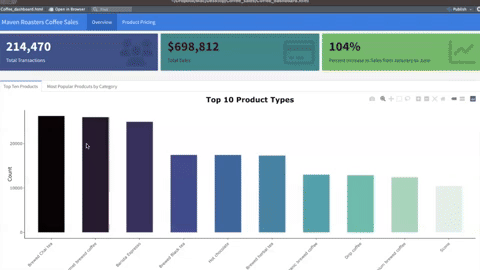
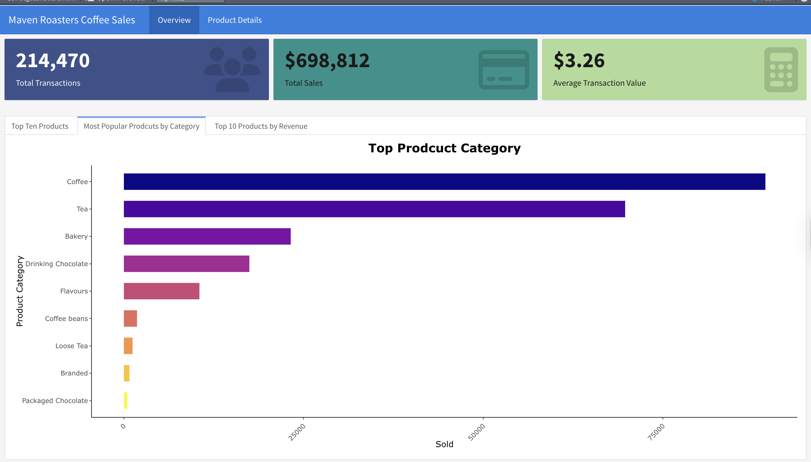

# Maven Roasters Coffee Sales Dashboard  

This Maven Coffee Sales Dashboard was created by using Flexdashboard in RStudio. The dataset is from Kaggle. 

  

##  Technologies
* R
* RStudio
* Flexdashboard
* Tidyverse
* Plotly
* KableExtra
* Viridis
* Readxl

### Dashboard Overview and Top Coffee Products 
  

### Dashboard Overview and Top Products by Category  
  

### Sales by Store Location and Sales Overtime  
  

### Product Price  
  
